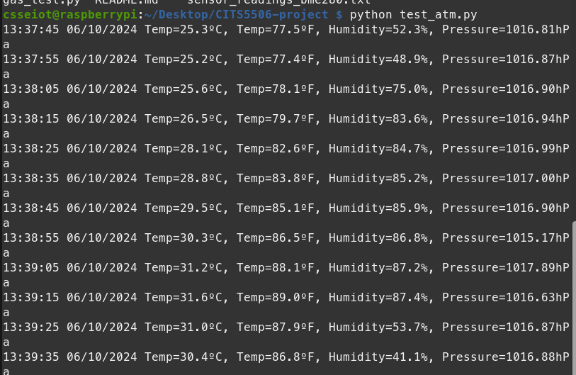
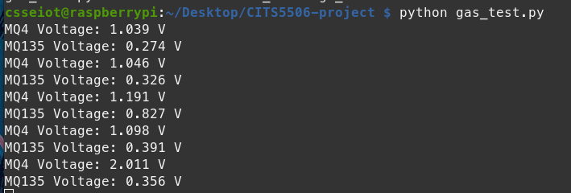

# Testing The Sensors

## 1. BME280 Sensor - Temperature and Humidity

- We're ignoring the pressure readings due to limitations in ability to control the pressure in the environment.

- The temperature was around 25°C and humidity was around 50%.
- When I enclosed the sensor in my hands, the temperature increased to around 31°C and humidity increased to about 80%, which is expected.
  - Hence, the sensor is working.

## 2. MQ-135 & MQ-4 Sensor - Gas detection

- Both sensors responded to my breath.
